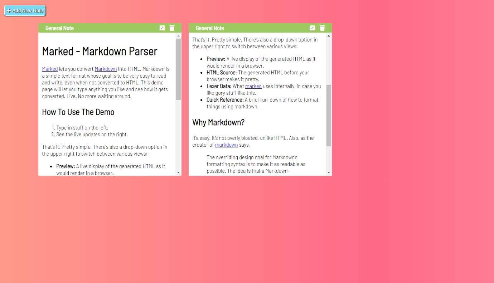

<h1>Online-note-keeper</h1>

This is a javascript project to create a Notes application that will allow user to write anything in the note page and that will be formatted properly when they will save it.
Users will be able to create new note pages, will be update content of the note pages and will be able to delete the note pages. All the data will be stored in local storage so
that data will not be lost even after refreshing browser.

</h1>Additional description about the project and its features.</h1>

<h2>Built With</h2>

Html

CSS

Javascript

<h2>Live Demo</h2>
https://onlinenotes-2020.netlify.app/

<h2>Getting Started</h2>
To get a local copy up and running follow these simple example steps.

Clone the repository and get the files in your local branch. Use it according
to your convenience.

Prerequisites
Text editor,Github profile and Git.

<h2>Authors</h2>

👤 Author1

Github: @ajkacca457

Twitter: @ajkacca

Linkedin: https://www.linkedin.com/in/avijit-karmaker-8738a54a/

🤝 Contributing
Contributions, issues and feature requests are welcome!

Feel free to check the issues page.

Show your support
Give a ⭐️ if you like this project!

#Acknowledgement
Project is inspired from Florin Pop youtube channel.

📝 <h2>License</h2>
This project is a personal project of Avijit.
